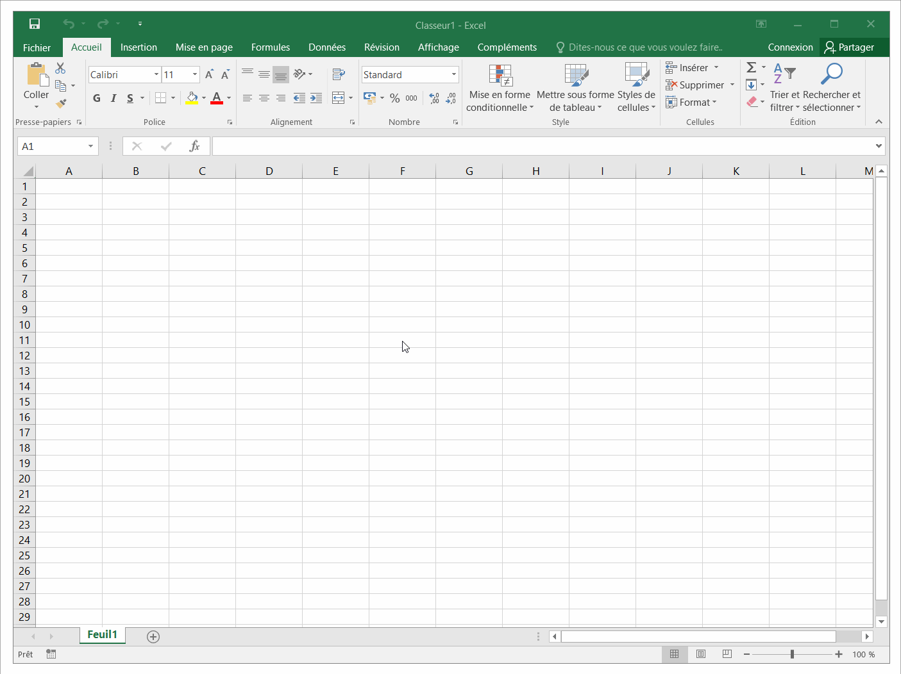

# VBA-Workbooks-for-electronic

Collection de classeurs pour la gestion des composants électroniques.

---

## Extraction-for-electronic-components

Gestion du stock des composants électroniques au sein d'un atelier d'électronique.

Ce classeur intègre les fonctionnalitées suivantes :

- Navigation dans le Classeur à travers des icônes
- Extraction automatique d'informations des composants électroniques depuis les sites Internet de RS et Farnell lors de l'ajout d'une nouvelle ligne dans le classeur
- Mise en avant des seuils bas du stock pour renouveller les quantités minimums

---

## Extracting-order-info-from-distributors

Extraction d'informations des commandes réalisées chez les distributeurs RS et Farnell.

---

## Usage and Debugging macros

Afin d'utiliser les macros du classeur, [vous devez autoriser celles-ci à s'exécuter](https://support.microsoft.com/fr-fr/office/activer-ou-d%C3%A9sactiver-les-macros-dans-les-fichiers-office-12b036fd-d140-4e74-b45e-16fed1a7e5c6).

### Make the Developer Ribbon visible in Excel

### The paste function in Excel requires a reference to the "Microsoft Forms 2.0 Object Library"

